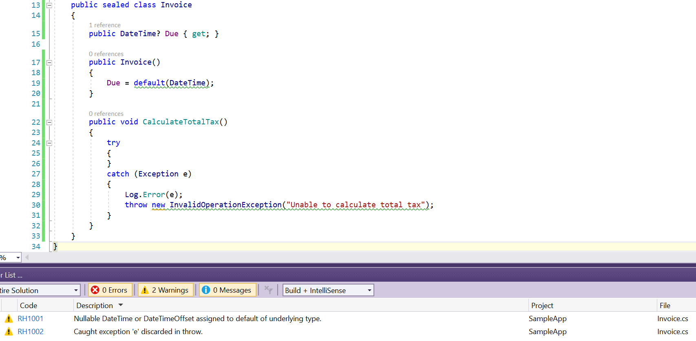

# ReviewHelp.Analyzers  
Code Analyzers to support reviewing code.

**Package** [ReviewHelp.Analyzers](https://www.nuget.org/packages/ReviewHelp.Analyzers) | **Platforms** .NET 4.6, .NET Standard 1.3

For rules, see https://jokokko.github.io/reviewhelp.analyzers/.

Note: the current analyzers exist to aid myself in locating sites to review. The warnings they produce need to evaluated in context of the application domain.

Some of the structure (docs, unit test helper) is copied from [xunit.analyzers](https://github.com/xunit/xunit.analyzers).